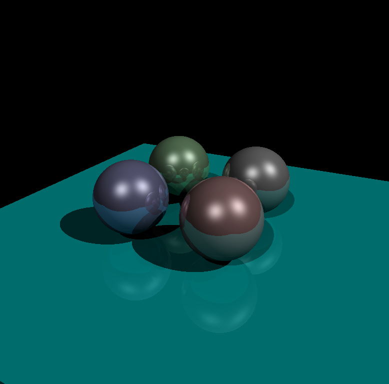
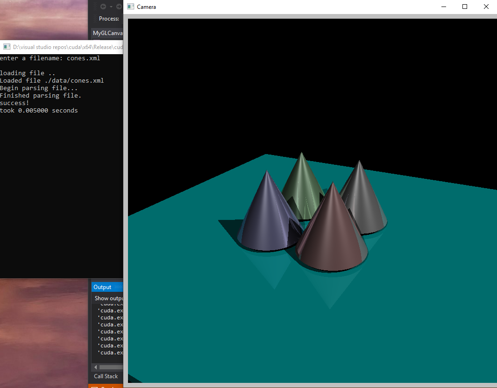
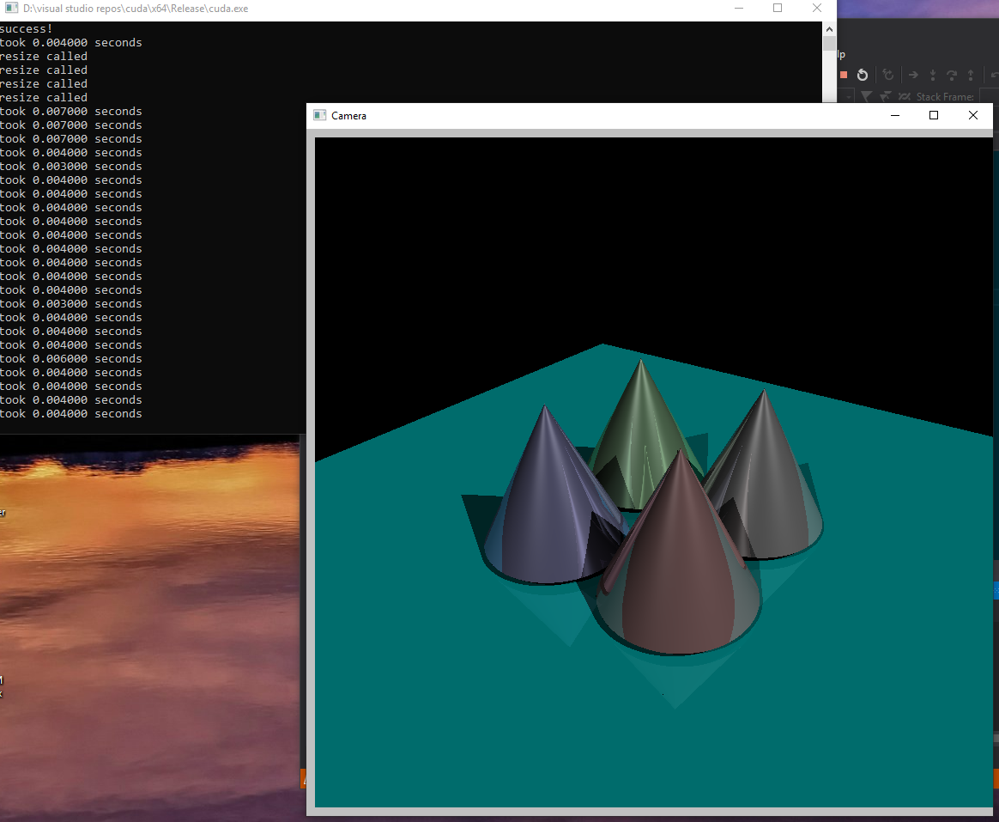
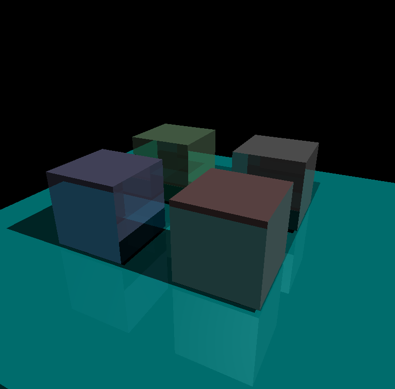
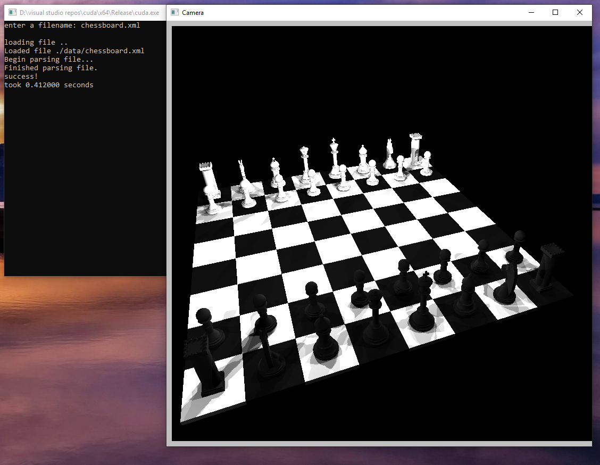

# cuda_raytracer

A recursive ray tracer written in C++ and Cuda C\
by Matt Russell\
May 2019\
\
This is an extension of a final project in the graphics course at Tufts [175].\
\
The code relies on fltk for the gui, and uses glm for standard matrix/vector operations.\
It requires a [cuda-capable gpu](https://developer.nvidia.com/cuda-gpus)\
The load times below are with a geforce gtx 1080.\
\
Feel free to build yourself (make sure to build fltk for x64), or simply run the executable (compatible with x64 windows systems).\
\
The 'ubuntu' branch includes an FLTK distribution that was built on Ubuntu 18.04 - just update the Makefile with relevant cuda  compilation and linking directories.\
\
Once an image has loaded, you can 'fly' around the scene with wasd keys - the image will reload in near-realtime.\
\
Default recursion depth is 50.\
\
With gratitude to Remco Chang from Tufts for teaching the graphics course, along with and Roger Alan and Peter Shirley for their great guides on cuda and ray tracing, respectively. Also to those who wrote various bits of the scene parsing code for xml files and ppm files - Nong Li, Remco Chang, Michael Shah, Eric Tamura, Yves Berquin, Tyge Løvset, and Lee Thomason.\
\
Also thanks to Rohan Deshpande and Ashley Suh, my project partners for the bulk of the course.\
\

\
Moving around the image.\

